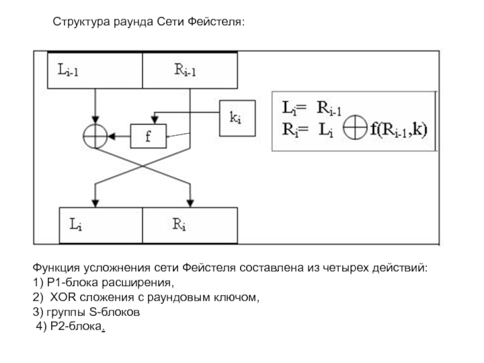
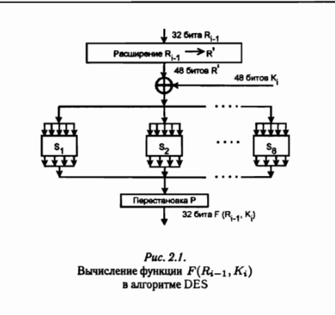
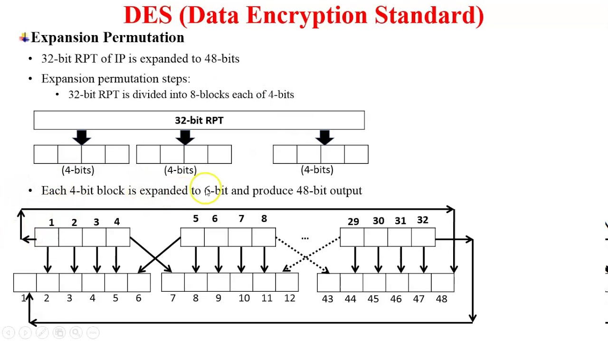
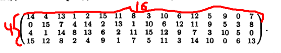
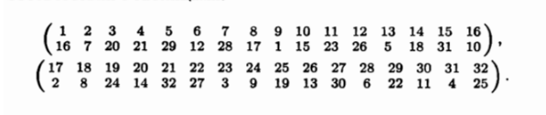

# Симметричные блочные шифры, схема Фейстеля, алгоритм des

## Симметричные блочные шифры

Весь текст разбивается на блоки определенной стандартной заданной длины (например, 64 бита), далее криптографические процедуры производятся с каждым блоком отдельно (на основании ключа шифрования формируются "подключи", кол-во которых может быть различно в зависимости от алгоритма, при чем проводится несколько итераций)

Шифрование каждого подблока текста произовдится в несколько этапов (раундов), на каждом раунде блок текста шифруется с использованием заданного подключа.

Симметричные блочные шифры используют для шифрования схему Фейстеля - разделение блоков длиной 64 бита на 2 блока по 32 бита.

---

## Схема Фейстеля

  

---

## DES (Data Encryption Standard)

Криптосистема DES принята в качестве государственного стандарта шифрования в США.

Секретный ключ длиной 64 бит

Наиболее легкий путь нелегального доступа к информации, зашифрованной DES, считается перебор всех возможных ключей, число которых 2^56

Основные процедуры: подстановка и перестановка, реализуемые соответственно S-блоками и P-блоками. Одним из основных критериев выбора S-блока является обеспечение ***размножения ошибок***. Каждый S-блок выбран таким образом, что изменение одного бита на входе приводит к изменению на выходе не менее двух битов.

  

### Схема работы DES

Криптосистема DES управляется 56-битовым секретным ключом пользователя, из которого в каждом их 16 проходов используются выбираемые псевдослучайно 48 бит Ki. Общая схема алгоритма DES состоит в следующем. 64-битовый блок открытого текста после начальной перестановки P делится на две части по 32 бита каждая. Левую и правую половину обозначим L и R. Затем выполняются 16 шифрующих раундов вида:

Li = Ri-1

Ri = Li-1 &#8853; F ( Ri-1, Ki )

Сущность алгоритма DES раскрывается преобразованиями, которые выполняются для получения значения функции F ( Ri-1, Ki ). Процедура вычисления значений этой функции включает в себя:
- Простую процедуру расширения 32-битового подблока R в 48 битовый подблок R'
- Линейное преобразование, заключающееся в выполнении операции поразрядного суммирования по модулю два над подблоком R' и подключом Ki.
- 8 операций подстановок типа 6 x 4 S1, S2, ..., S8
- Операции перестановки P.

---

### Подробное описание процесса (пи***ц)

Операция расширения:

После выполнения раширения имеются 8 6-битовых подблока, над каждым из которых выполняется операция подстановки типа 6 х 4, дающая на выходе 4-битовое значение. Каждая из восьми подстановок задается таблицей из 4-ех строк, которые представляют собой некоторые перестановки полного набора 4-битовых чисел {0 - 15}. Например, подстановка S1 задается такой таблицей:

Выполнение операции подстановки состоит в следующем. На основе 6-битового входного подблока формируются два двоичных вектора V1 и V2. Векто V1 представляет собой 2-битовый подблок, содержащий 1-й и 6-й биты входного подблока, а вектор V2 содержит четыре средних бита (смотри операцию расширения). Число, находящееся на пересечении строки с номером V1 и столбца с номером V2 берется в качестве выходного 4-битового подблока(***ЧТО ЭТО?***).

Еле разобрался... При расширении мы имеем блоки по 6 бит, например, (010111). Берем первое число и послденее, это будет 01 при переводе в десятичную систему это 1, значит, берем первую строку. 1011 - 11 в десятичной, берем 11 столбец. И получаем из таблицы число от 0 до 16, а значит, вернулись к 4 битам (было 6 после расширения).

Всего используются 8 разных таблиц подстановки, аналогичных приведенной выше. После выполнения восьми операций подстановки все 4-битовые выходные значения объединяются в 32-битовый подблок, над которым затем выполняется операция перестановки в соответствии с таблицами:

В этих таблицах верхняя строчка обозначает порядковый номер позиции входных битов, а нижняя строчка - номер позиции, в которую переставляются соответствующие биты.
