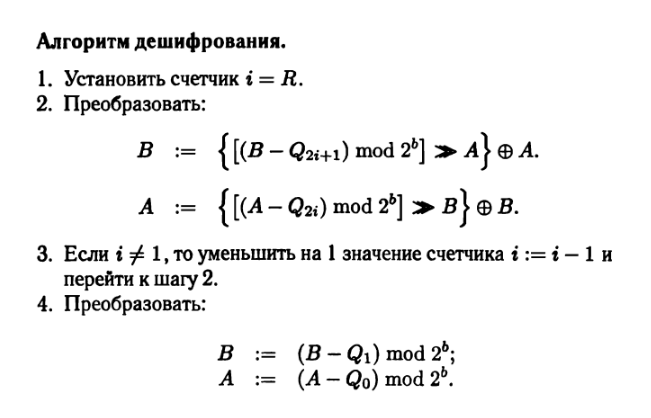

# Криптосистема RC5
В этой криптосистеме предусмотрена возможность задания пользователем числа раундов и размера входного блока данных. Входной блок разбивается на 2 подблока одинаковой длины. Обозначим длину подблока за b. Шифрование заключается в поочередном преобразовании подблоков с использованием операций поразрядного суммирования по модуля два, суммированию по модулю 2b и управляемых оперций циклического сдвига.
## Алгоритм
Вход: исходное значение b-битовых подблоков A и B.
1. Установить счетчик i := 1 и число раундов R и выполнить преобразования:
   - A := (A + Q0) mod 2b
   - B := (B + Q1) mod 2b
    > Алгоритм предвычислений формирует ключ шифрования необходимого размера. Могут быть применены различные варианты ключа. Обозначим ключ шифрования как последовательность подключей Q0, ..., Q2R+1
2. Преобразовать:
   - A := { [ (A &#8853; B) <<< B ] + Q2i } mod 2b
   - B := { [ (B &#8853; A) <<< A] + Q2i+1} mod 2b
3. Если i != R, то прирастить i := i + 1 и перейти к шагу 2
4. СТОП
Выход: Преобразованное значение подблоков A и B

## Главный плюс
Главный плюс данного шифра - высокая скорость при программной реализации за счет того что операция циклического сдвига относится к быстрым элементарным операциям.